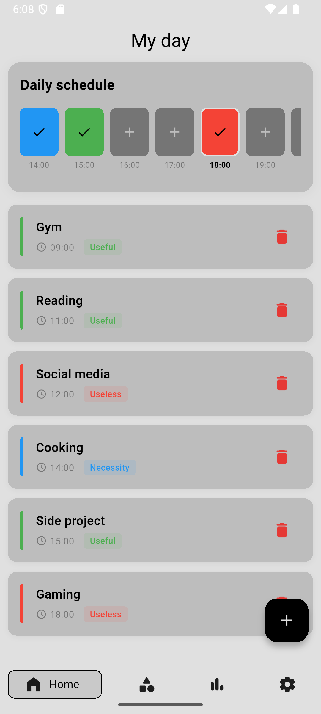
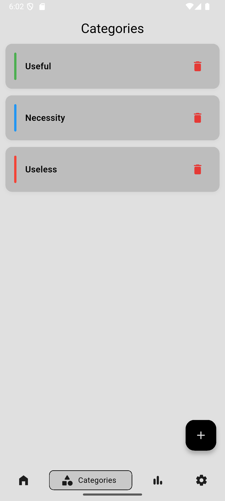
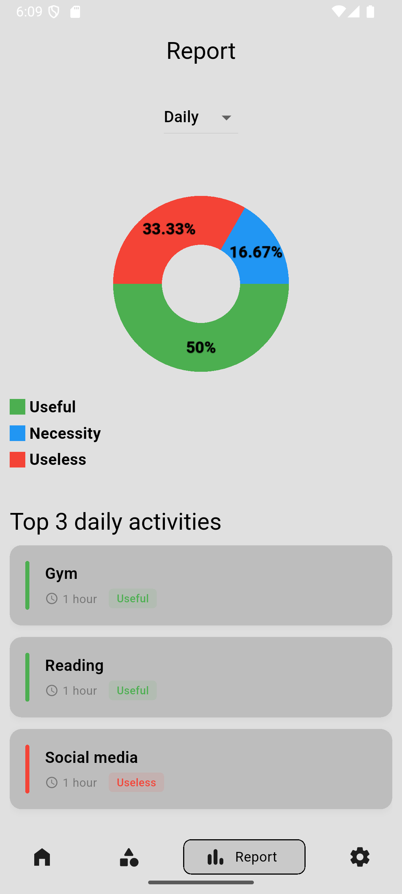
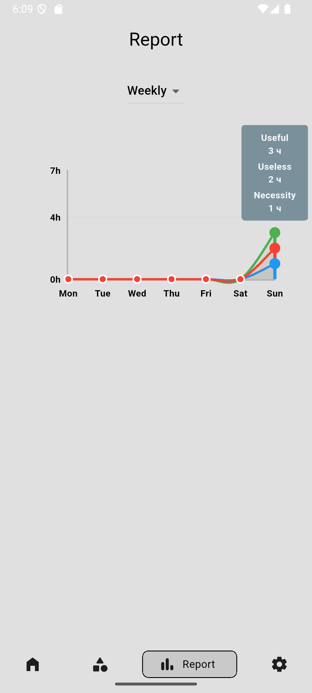

# TimeTrace

**TimeTrace** is a simple and private time tracking app that helps you understand how you spend your day — hour by hour.

Log activities, review daily and weekly statistics, and build awareness of your time habits without accounts or internet access.

---

## ✨ Features

- Hourly time tracking
- Daily and weekly statistics
- Custom activity categories
- Fully offline
- No accounts, no tracking
- Data stored only on your device
- CSV export and import
- Clean and minimal interface

---

## 📱 Screenshots

  
  
  
  

---

## 📦 Platform

- Android (Flutter)
- iOS (Flutter)

---

## 📬 Contact

Email: teksoulapps@gmail.com  
GitHub: https://github.com/printHelloworldd 
Issues and pull requests are welcome.
